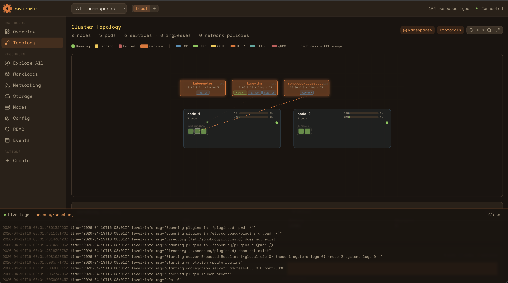
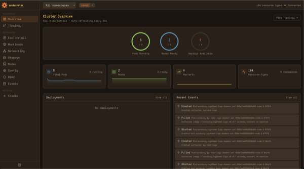
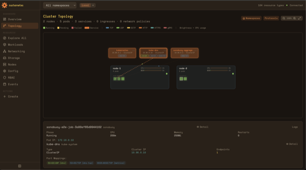
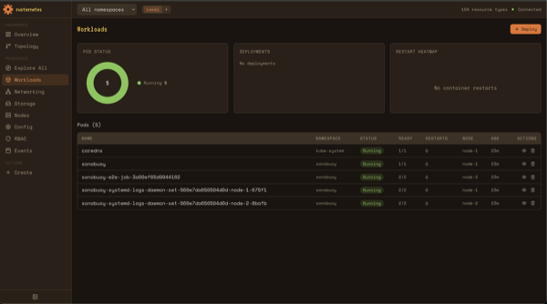
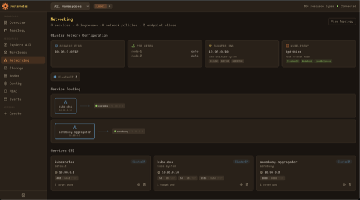
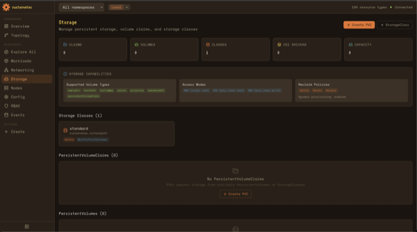
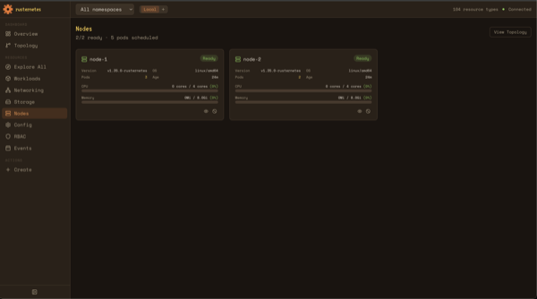
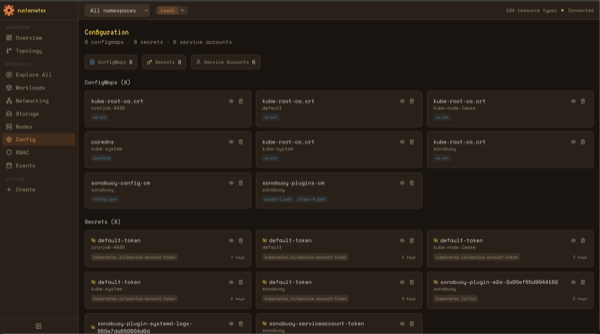
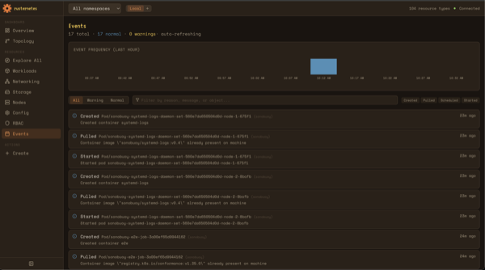
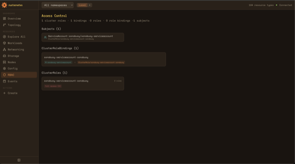

# Rūsternetes

**A ground-up reimplementation of Kubernetes in Rust.**

216,000+ lines of Rust across 10 crates. 31 controllers. 3,100+ tests. Actively conformance-tested against the official Kubernetes e2e test suite — currently passing 90% of conformance tests (398/441) across 149 rounds of testing.

This isn't a wrapper around the Go codebase or a partial mock. Every component — API server, scheduler, controller manager, kubelet, kube-proxy — is written from scratch in Rust, implementing the actual Kubernetes API surface, wire format, and behavioral semantics.

## Web Console

Rūsternetes includes a built-in web console with real-time cluster topology visualization, live metrics, pod log streaming, and full resource management. It deploys automatically — embedded in the API server, no separate installation.

[](docs/screenshots/console-topology-logs.png)

| | | |
|---|---|---|
| [](docs/screenshots/console-overview.png) | [](docs/screenshots/console-topology.png) | [](docs/screenshots/console-workloads.png) |
| **Overview** — Health rings, sparkline charts, deployment rollout progress, event feed | **Topology** — Animated node/pod/service map with traffic particles, CPU heatmap, protocol badges | **Workloads** — Pod phase chart, deployment cards with scale/restart, restart heatmap |
| [](docs/screenshots/console-networking.png) | [](docs/screenshots/console-storage.png) | [](docs/screenshots/console-nodes.png) |
| **Networking** — Service CIDR, DNS, kube-proxy config, service routing diagrams | **Storage** — Capabilities, StorageClass provisioning, PVC/PV management | **Nodes** — CPU/memory gauges from real Docker stats, cordon/uncordon |
| [](docs/screenshots/console-config.png) | [](docs/screenshots/console-events.png) | [](docs/screenshots/console-rbac.png) |
| **Config** — ConfigMaps with key badges, Secrets, Service Accounts | **Events** — Frequency histogram, type/reason filtering, auto-refresh | **RBAC** — Subject-role mapping, binding visualization, rule badges |

See the [Console User Guide](docs/CONSOLE_USER_GUIDE.md) for full documentation.

## Architecture

```
┌───────────────────────────────────────────────────────────────┐
│                       Control Plane                           │
│                                                               │
│  ┌──────────────────┐  ┌──────────────┐  ┌────────────────┐   │
│  │  API Server      │  │  Scheduler   │  │  Controller    │   │
│  │  Axum + TLS      │  │  Affinity    │  │  Manager       │   │
│  │  REST + Watch    │  │  Taints      │  │  31 control    │   │
│  │  RBAC + Webhooks │  │  Preemption  │  │  loops         │   │
│  │  Web Console     │  │              │  │                │   │
│  └────────┬─────────┘  └──────────────┘  └────────────────┘   │
│           │                                                   │
│  ┌────────▼─────────┐                                         │
│  │ Storage          │                                         │
│  │ etcd | SQLite    │                                         │
│  └──────────────────┘                                         │
├───────────────────────────────────────────────────────────────┤
│                       Node Components                         │
│                                                               │
│  ┌──────────────────┐  ┌──────────────────────────────────┐   │
│  │  Kubelet         │  │  Kube-Proxy                      │   │
│  │  bollard (Docker)│  │  iptables routing                │   │
│  │  Probes+Volumes  │  │  ClusterIP/NodePort/LB           │   │
│  └──────────────────┘  └──────────────────────────────────┘   │
└───────────────────────────────────────────────────────────────┘
```

## Deploy Your Way

Rusternetes supports three deployment modes from the same codebase:

**Full cluster with etcd** — the standard production deployment with separate containers per component, backed by an etcd cluster with Raft consensus and leader election.

**Swap the database** — replace etcd with [Rhino](https://github.com/calfonso/rhino), an etcd-compatible gRPC server written in Rust that stores everything in SQLite, PostgreSQL, or MySQL. Same Kubernetes API, same binaries, zero etcd infrastructure. Just change the compose file.

**Single binary, single process** — all five components running as concurrent tokio tasks in one process with an embedded SQLite database. No containers, no external dependencies. Your entire cluster state lives in a single SQLite file — back it up with `cp`, inspect it with `sqlite3`, move it to another machine.

The all-in-one mode is built for environments where a full K8s cluster is overkill: edge devices, CI/CD pipelines, local development, IoT gateways, embedded systems, and air-gapped environments.

## Quick Start

### Full cluster (Podman + etcd)

```bash
git clone https://github.com/calfonso/rusternetes.git
cd rusternetes

export KUBELET_VOLUMES_PATH=$(pwd)/.rusternetes/volumes
podman compose build
podman compose up -d
bash scripts/bootstrap-cluster.sh

export KUBECONFIG=~/.kube/rusternetes-config
kubectl get nodes
kubectl create deployment nginx --image=nginx
```

### Full cluster (Docker Compose + etcd)

```bash
git clone https://github.com/calfonso/rusternetes.git
cd rusternetes

export KUBELET_VOLUMES_PATH=$(pwd)/.rusternetes/volumes
docker compose build
docker compose up -d
bash scripts/bootstrap-cluster.sh

export KUBECONFIG=~/.kube/rusternetes-config
kubectl get nodes
```

### Full cluster with SQLite (no etcd)

Same cluster, but [Rhino](https://github.com/calfonso/rhino) replaces etcd. No recompilation needed — same binaries.

```bash
# Podman
podman compose -f compose.sqlite.yml build
podman compose -f compose.sqlite.yml up -d

# Docker
docker compose -f docker-compose.sqlite.yml build
docker compose -f docker-compose.sqlite.yml up -d

bash scripts/bootstrap-cluster.sh
```

### All-in-one binary

Full Kubernetes in a single process with embedded SQLite:

```bash
cargo build -p rusternetes
./target/release/rusternetes --data-dir ./cluster.db
```

**Prerequisites:** Podman or Docker for the kubelet to manage containers. On Linux with Podman, rootful mode is required for kube-proxy iptables access. See [DEVELOPMENT.md](docs/DEVELOPMENT.md) for detailed setup.

## What's Implemented

### API Server
Axum-based HTTPS server implementing the Kubernetes REST API. 76 handler modules covering core/v1, apps/v1, batch/v1, rbac.authorization.k8s.io/v1, storage.k8s.io/v1, networking.k8s.io/v1, and more.

- Full CRUD for all major resource types
- Watch API with Server-Sent Events
- Server-Side Apply, Strategic Merge Patch, JSON Patch
- Field selectors and label selectors
- Custom Resource Definitions with watch, status/scale subresources, schema validation
- Validating and Mutating Admission Webhooks
- ValidatingAdmissionPolicy with CEL expressions
- RBAC authorization with Roles, ClusterRoles, and Bindings
- ServiceAccount JWT token signing (RS256)
- TLS/mTLS, audit logging, Pod Security Standards
- OpenAPI v3 discovery, aggregated discovery

### Scheduler
Filter/score plugin architecture with:
- Node/Pod affinity and anti-affinity
- Taints and tolerations
- Resource requests and limits scoring
- Priority classes and preemption
- Topology spread constraints

### Controller Manager
31 reconciliation controllers running concurrent loops:

| Controller | What it does |
|---|---|
| Deployment | Rolling updates, rollbacks, revision history |
| ReplicaSet | Desired replica count enforcement |
| ReplicationController | Legacy RC support |
| StatefulSet | Ordered pod management, stable network IDs |
| DaemonSet | Per-node pod scheduling |
| Job | Run-to-completion workloads, indexed completion |
| CronJob | Scheduled job creation |
| Endpoints | Service endpoint maintenance from pod selectors |
| EndpointSlice | Scalable endpoint slicing |
| Service | ClusterIP allocation, service lifecycle |
| ServiceAccount | Default SA creation, token management |
| Namespace | Finalization, resource cleanup |
| Node | Node status, heartbeat monitoring |
| PV Binder | PersistentVolume to PVC binding |
| Dynamic Provisioner | Automatic PV creation from StorageClasses |
| Volume Snapshot | Snapshot lifecycle management |
| Volume Expansion | Online PVC resize |
| ResourceQuota | Namespace resource usage tracking |
| ResourceClaim | Dynamic Resource Allocation |
| HPA | Horizontal Pod Autoscaler |
| VPA | Vertical Pod Autoscaler |
| PDB | Pod Disruption Budget enforcement |
| LoadBalancer | External LB provisioning (cloud + MetalLB) |
| Ingress | Ingress resource management |
| NetworkPolicy | Network policy lifecycle |
| CRD | Custom resource schema validation |
| CSR | Certificate signing requests |
| Garbage Collector | Owner reference cascade deletion |
| TTL Controller | Finished resource cleanup |
| Taint Eviction | Evict pods from tainted nodes |
| Events | Event recording and TTL cleanup |

### Kubelet
Container runtime integration via [bollard](https://github.com/fussybeaver/bollard) (Docker API):
- Pod lifecycle: create, start, stop, restart with grace periods
- Pause container network namespace sharing
- Liveness, readiness, and startup probes (HTTP, TCP, exec)
- Volume mounts: emptyDir, hostPath, projected, configMap, secret, downwardAPI
- Container resource limits (CPU, memory)
- Init containers and sidecar containers
- Lifecycle hooks (preStop, postStart) — exec and httpGet
- Container log retrieval
- Pod exec and attach via WebSocket
- Sysctls, fsGroup, IPC namespace sharing

### Kube-Proxy
iptables-based service routing in host network mode:
- ClusterIP, NodePort, LoadBalancer service types
- Session affinity (ClientIP)
- Endpoints and EndpointSlice consumption
- Service CIDR routing

### Storage
Pluggable storage backend with `Storage` trait:
- **etcd backend** — production use with optimistic concurrency (CAS via mod_revision)
- **SQLite via rhino** — lightweight alternative, no etcd cluster needed. Available as a gRPC server (`docker-compose.sqlite.yml`) or embedded in-process (all-in-one binary)
- **Memory backend** — unit testing
- Key schema: `/registry/{resource_type}/{namespace}/{name}`

See [Storage Backends](docs/storage/STORAGE_BACKENDS.md) for full details on deployment modes.

## Conformance

Rusternetes is actively tested against the official Kubernetes v1.35 conformance test suite using [Sonobuoy](https://sonobuoy.io/).

| Round | Pass | Total | Rate | Notes |
|-------|------|-------|------|-------|
| 97 | ~40 | 441 | ~9% | Baseline |
| 101 | 245 | 441 | 56% | 76 fixes deployed |
| 141 | 368 | 441 | 83% | Watch + storage fixes |
| 146 | 379 | 441 | 86% | CRD + scheduler fixes |
| 149 | 398 | 441 | 90% | Latest full run |

```bash
# Run conformance tests
bash scripts/run-conformance.sh

# Monitor progress
bash scripts/conformance-progress.sh
```

See [CONFORMANCE_FAILURES.md](docs/CONFORMANCE_FAILURES.md) for the full fix tracker.

## Project Structure

```
crates/
  api-server/          Axum HTTPS API (76 handler modules, 2500-line router)
  controller-manager/  31 reconciliation controllers
  scheduler/           Filter/score plugin scheduling
  kubelet/             Container runtime, probes, volumes
  kube-proxy/          iptables service routing
  storage/             Pluggable storage: etcd, SQLite (rhino), memory
  common/              Shared types (36 resource modules), errors, utilities
  kubectl/             CLI tool
  cloud-providers/     AWS, GCP, Azure integrations
  rusternetes/         All-in-one binary (all components as tokio tasks)

scripts/
  bootstrap-cluster.sh   Bootstrap CoreDNS, services, SA tokens
  run-conformance.sh     Full conformance test lifecycle
  conformance-progress.sh  Monitor pass/fail progress
  generate-certs.sh      TLS certificate generation

docs/                  Architecture, guides, conformance tracking
```

## Development

```bash
cargo build                    # Debug build
cargo test                     # All workspace tests
cargo test -p rusternetes-api-server  # Single crate
cargo clippy --all-targets --all-features -- -D warnings
make pre-commit                # Format + clippy + test
```

See [DEVELOPMENT.md](docs/DEVELOPMENT.md) for the full guide and [CONTRIBUTING.md](docs/CONTRIBUTING.md) for contribution guidelines.

## Documentation

**[Full Documentation Site](docs/guide/index.html)** — 30 pages covering every feature, configuration option, and use case.

| Topic | Link |
|-------|------|
| Quick Start | [Quick Start](docs/guide/quickstart.html) |
| Deployment Modes | [Deployment Overview](docs/guide/deployment.html) |
| All-in-One Binary | [All-in-One](docs/guide/all-in-one.html) |
| Configuration | [API Server](docs/guide/api-server-config.html) / [Kubelet](docs/guide/kubelet-config.html) / [Storage](docs/guide/storage-config.html) |
| Features | [Workloads](docs/guide/workloads.html) / [Networking](docs/guide/networking.html) / [Security](docs/guide/security.html) / [CRDs](docs/guide/crds.html) |
| Web Console | [Console](docs/guide/console.html) / [CONSOLE.md](docs/CONSOLE.md) |
| Authentication | [Authentication](docs/guide/authentication.html) / [AUTHENTICATION.md](docs/AUTHENTICATION.md) |
| kubectl | [kubectl Reference](docs/guide/kubectl.html) |
| API Reference | [API Reference](docs/guide/api-reference.html) |
| Conformance | [Conformance Status](docs/guide/conformance.html) |
| Development | [DEVELOPMENT.md](docs/DEVELOPMENT.md) |

## License

Apache-2.0
