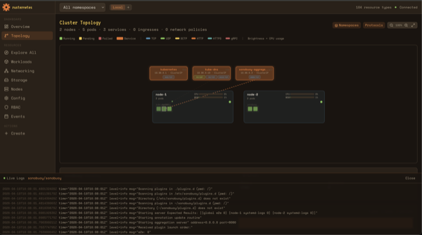
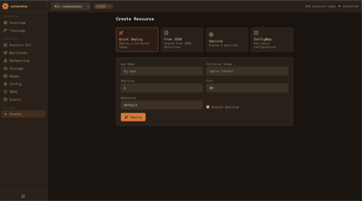

# Rusternetes Console

The rusternetes console is a web-based cluster management dashboard served directly from the API server. It provides real-time topology visualization, live metrics, pod log streaming, and full resource management — with zero external dependencies.

## Accessing the Console

Open your browser to `https://localhost:6443/console/`. You'll need to accept the self-signed certificate warning on first visit.

The console auto-deploys with the cluster — no separate setup needed. It's baked into the API server Docker image and served at `/console/`.

## Overview Dashboard

[](screenshots/console-overview.png)

The Overview is the landing page showing real-time cluster health at a glance.

**Health Rings** — Three animated circular gauges at the top showing:
- **Pods Running** (green) — running pods vs total pods
- **Nodes Ready** (blue) — ready nodes vs total nodes
- **Deploys Available** (orange) — available deployments vs total

**Metrics Cards** — Four cards below the rings with live sparkline charts:
- **Total Pods** — count with trend over time. Click to browse all pods.
- **Nodes** — count with ready count. Click to go to Nodes view.
- **Restarts** — total container restart count. Color changes to red when high.
- **Resource Types** — how many API resource types were discovered. Click to open the Resource Explorer.

The sparklines collect data every 30 seconds and show the last 30 minutes of history.

**Deployments** — Shows deployment rollout progress with color-coded bars:
- Green = fully available
- Yellow = partially ready
- Red = no ready replicas

Click "View all" to see all deployments.

**Recent Events** — Live event feed showing the latest cluster activity. Warning events are highlighted in yellow. Click "View all" to go to the full Events view.

## Cluster Topology

[](screenshots/console-topology.png)

The Topology view is an animated visual map of your entire cluster.

**Nodes** — Shown as containers with:
- Node name and pod count
- CPU and Memory utilization bars with percentages (from real Docker stats)
- Green dot = Ready, pulsing red dot = NotReady

**Pods** — Colored squares inside their node:
- Green = Running
- Yellow = Pending
- Red = Failed
- Brightness indicates CPU usage — brighter pods are using more CPU

**Services** — Orange boxes across the top showing:
- Service name and ClusterIP
- Service type (ClusterIP, NodePort, LoadBalancer)
- Protocol/port badges (TCP, UDP, etc.)
- Endpoint count

**Network Connections** — Animated dashed lines connecting services to their target pods. Tiny particles flow along the lines showing traffic direction. Lines fan out from the service bottom edge.

**Controls:**
- **Namespaces** toggle — shows/hides namespace color zones around pod groups
- **Protocols** toggle — shows/hides port/protocol badges on services
- **Zoom** — in/out/reset controls

**Click a Pod** to:
- See its detail panel (phase, CPU, memory, restarts, IP, ports)
- Automatically open live logs in a bottom overlay
- Highlight its service connections

**Click a Service** to see its detail panel (type, ClusterIP, endpoints, port mappings).

### Live Logs

[](screenshots/console-topology-logs.png)

When you click a pod in the topology, a **Live Logs** panel slides up from the bottom of the screen showing the pod's recent log output.

- Timestamps are dimmed for readability
- Log levels are color-coded: ERROR (red), WARN (yellow), INFO (blue)
- Green pulsing dot indicates logs are streaming (refreshes every 5 seconds)
- Click "Close" or click the pod again to dismiss

### Activity Timeline

At the bottom of the topology view, the **Cluster Activity** timeline shows:
- A bar chart of pod count history over the last 30 minutes
- Green bars = pods added, red bars = pods removed
- Live indicator (pulsing green dot) when viewing current state
- Click any bar to see the cluster state at that point in time
- Pod count, node count, and service count for the selected time

## Resource Explorer

Navigate to **Explore All** in the sidebar to see every resource type in the cluster.

The explorer auto-discovers all resource types from the API server, including CRDs. Resources are grouped into categories:
- Workloads, Networking, Storage, Access Control, Configuration, Cluster, Extensions, etc.

**Search** — Type in the search bar to filter by kind, plural name, or short name (e.g., "po", "deploy", "svc").

**Resource Cards** — Each resource type shows:
- Kind name and API group/version
- Short names (e.g., "po" for pods)
- "ns" badge if namespaced
- Live resource count

Click any resource type to open its list view.

## Resource List View

When you click a resource type in the Explorer, you see a table of all instances:
- Name (clickable to view details), Namespace, Status, Age
- **Search** bar to filter by name or namespace
- **Create** button opens the create form pre-populated for this resource type
- **Refresh** button to re-fetch data
- **Delete** button (trash icon) on each row with confirmation
- **View** button (eye icon) to open the detail view

The list updates in real-time via K8s watch streams — resources appear and disappear live.

## Resource Detail View

Click any resource name to see its full details:

**Overview Tab:**
- Metadata: UID, generation, deletion timestamp, finalizers
- Labels displayed as colored chips
- Conditions table with status badges, reasons, messages, and age
- Owner references with controller badges
- Annotations

**YAML/JSON Tab:**
- Full resource JSON in an editor
- Edit the JSON and click **Save** to apply changes
- **Reset** to revert to the server version
- Changes are applied via PUT to the K8s API

**Events Tab:**
- Events filtered to this specific resource
- Auto-refreshes every 15 seconds

**Actions (in header):**
- **Scale** (Deployments/StatefulSets) — +/- buttons to adjust replica count
- **Restart** (Deployments/StatefulSets/DaemonSets) — rolling restart via annotation
- **Copy** — copy the full JSON to clipboard
- **Delete** — delete the resource with confirmation

## Workloads

[](screenshots/console-workloads.png)

Navigate to **Workloads** in the sidebar.

**Pod Phase Chart** — Donut chart showing the breakdown of pod phases (Running, Pending, Failed, Succeeded).

**Deployment Cards** — Each deployment shows:
- Name and namespace
- Rollout progress bar (green/yellow/red based on readiness)
- Ready/desired replica count
- Scale controls (+/- buttons)
- Restart button for rolling restart
- View and delete actions

**Restart Heatmap** — Shows pods with the most container restarts. Bar length indicates restart count relative to the worst pod.

**Pod Table** — Full table of all pods with:
- Name (clickable), namespace, status badge, ready count, restart count, node, age
- View and delete actions per row
- Real-time updates via watch

**Zero State** — When no workloads exist, shows a "Quick Deploy" button to create your first deployment.

## Networking

[](screenshots/console-networking.png)

**Cluster Network Configuration** — Four cards showing:
- **Service CIDR** — the IP range for ClusterIP services (e.g., 10.96.0.0/12)
- **Pod CIDRs** — per-node pod CIDR allocations
- **Cluster DNS** — kube-dns ClusterIP, ports (53/UDP, 53/TCP, 9153/TCP)
- **Kube-Proxy** — mode (iptables), supported service types

This panel shows even when there are no services — it's always useful context.

**Service Type Summary** — Colored chips showing how many services of each type exist (ClusterIP, NodePort, LoadBalancer).

**Service Routing** — Visual diagrams showing service-to-pod connections. Each service box connects with an arrow to its target pods, showing pod name, status, and IP.

**Service Cards** — Cards for each service showing type badge, ClusterIP, port mappings (with arrows showing port→targetPort/protocol), and target pod count.

**Ingresses** and **Network Policies** — Tables and cards for these resources when they exist.

## Storage

[](screenshots/console-storage.png)

**Overview Panel** — Five stat cards: Claims, Volumes, Classes, CSI Drivers, Total Capacity.

**Storage Capabilities** — What the cluster supports:
- Supported volume types (emptyDir, hostPath, configMap, secret, projected, etc.)
- Access modes (RWO, ROX, RWX) with descriptions
- Reclaim policies (Delete, Retain, Recycle)
- Dynamic provisioning status

**Create StorageClass** — Click the "StorageClass" button to open an inline form:
- Name, provisioner (defaults to rusternetes.io/hostpath), reclaim policy, binding mode
- Helper text explains what each provisioner does

**Create PVC** — Click "Create PVC" to open an inline form:
- Name, namespace, Storage Class dropdown (populated from existing classes), size, access mode
- Shows "Create a StorageClass first" hint when none exist

**StorageClass Cards** — Show provisioner, reclaim policy, binding mode, and expandable badge.

**PVC Cards** — Show status (Bound/Pending), requested size, actual capacity, access modes, storage class, and PV binding.

**PV Table** — Status, capacity, reclaim policy, and claim reference.

## Nodes

[](screenshots/console-nodes.png)

**Node Cards** — Each node shows:
- Name (clickable to detail view) and Ready/NotReady status badge
- Role badges (e.g., "control-plane")
- "cordoned" badge if unschedulable
- Version, OS/architecture, pod count, age
- **CPU gauge** — real utilization bar with percentage from Docker stats
- **Memory gauge** — real utilization bar with percentage
- Taint badges showing key=value:effect
- **View** button and **Cordon/Uncordon** toggle

## Configuration

[](screenshots/console-config.png)

**Summary Chips** — ConfigMaps count, Secrets count, Service Accounts count.

**ConfigMap Cards** — Name, namespace, data key badges (colored by key name). View and delete actions.

**Secret Cards** — Name, namespace, type badge (e.g., kubernetes.io/service-account-token), key count. Eye-off icon indicates secret content. View and delete actions.

**Service Account List** — Compact cards showing name and namespace. Click to view details.

## RBAC (Access Control)

[](screenshots/console-rbac.png)

**Subjects** — Shows who has access. Each card displays:
- Subject identity (ServiceAccount, Group, or User) with colored icon
- Roles bound to this subject

**ClusterRoleBindings** — Visualizes subject → role connections:
- Subject badges colored by type (teal=ServiceAccount, yellow=Group, blue=User)
- Arrow pointing to the role reference

**ClusterRoles** — Cards showing:
- Role name and rule count
- Rule badges showing verbs (get, list, create, etc.) and resources
- "full access (*)" indicator for admin roles

Click "View all" links to see the complete list via the Resource Explorer.

## Events

[](screenshots/console-events.png)

**Event Frequency Histogram** — Stacked bar chart showing event count over the last hour in 5-minute buckets. Blue = Normal, yellow = Warning.

**Filter Controls:**
- **Type filter** — All, Warning, Normal. Warning count shown as badge.
- **Text search** — Filter by reason, message, or involved object name.
- **Quick reason filters** — One-click buttons for common reasons (Created, Pulled, Scheduled, Started).

**Event List** — Each event shows:
- Severity icon (blue=Normal, yellow=Warning, red=Error)
- Reason and involved object (clickable to navigate to that resource)
- Message text
- Time ago and occurrence count
- Warning events have amber background

Auto-refreshes every 10 seconds. Shows up to 100 events.

## Create Resource

[](screenshots/console-create.png)

Four creation modes:

**Quick Deploy** — Form-based deployment:
- App name, container image, replicas, port, namespace
- Optional "Create Service" checkbox to expose the deployment
- Click Deploy to create the Deployment (and optionally Service)

**From JSON** — Paste or edit a JSON resource definition:
- Pre-populated with a Deployment template
- When opened from a resource list's Create button, pre-populated with the correct resource type template

**Service** — JSON template pre-populated for creating a Service.

**ConfigMap** — JSON template pre-populated for creating a ConfigMap.

## Multi-Cluster (Fleet Mode)

Click the **Fleet** button in the header bar to enable multi-cluster mode.

- Click **+** to register a remote cluster (name + API server URL)
- Click a cluster name to switch active context
- All views automatically route API calls to the selected cluster
- Cluster registrations persist in browser localStorage

## Namespace Filtering

Use the **namespace dropdown** in the header bar to filter all views to a specific namespace. Select "All namespaces" to see everything.

## Header Bar

The header bar shows:
- **Namespace selector** — filter all views by namespace
- **Fleet cluster switcher** — switch between clusters (when enabled)
- **Resource type count** — how many API resource types were discovered
- **Connection status** — green dot with "Connected" indicator

---

## Architecture

The console is a React single-page application served by the Axum API server at `/console/`. Because the SPA and API share the same origin, there is no CORS configuration, no nginx proxy, and no separate deployment.

```
Browser ─── https://localhost:6443/console/
                │
                ├── /console/              Static SPA (Axum ServeDir)
                ├── /api/v1/pods           K8s REST API (same server)
                ├── /api/v1/pods?watch=1   Watch stream (chunked HTTP)
                └── /apis/apps/v1/...      API group resources
```

### Tech Stack

| Layer | Technology |
|-------|-----------|
| Frontend | React 19, TypeScript 5.9 |
| Bundler | Vite |
| State | Zustand (UI state) + TanStack Query (server state) |
| Styling | Tailwind CSS + Radix UI |
| Charts | Recharts |
| Serving | Axum `tower-http::ServeDir` |

### K8s API Client

The console communicates with the API server using the standard Kubernetes REST protocol. No custom endpoints are needed.

- **Resource Discovery** — fetches `/api/v1` and `/apis` to discover all resource types (including CRDs), cached for 5 minutes
- **Watch Streams** — chunked HTTP with newline-delimited JSON, `resourceVersion` tracking, bookmark support, exponential backoff reconnection (1s to 30s), 410 Gone recovery
- **Authentication** — reads JWT from `sessionStorage`, passes as `Authorization: Bearer`. No token needed in `--skip-auth` mode.

### CLI Flags

| Flag | Default | Description |
|------|---------|-------------|
| `--console-dir` | *(disabled)* | Path to the console SPA build directory. Enables the web console at `/console/`. |

The console auto-deploys in Docker Compose — the Dockerfile builds the SPA and bakes it into the API server image at `/app/console`.

### Development

```bash
# Terminal 1: start the API server
./target/release/rusternetes

# Terminal 2: start the console dev server (hot reload)
cd console
npm install
npm run dev
# Open http://localhost:3000/console/
# Vite proxies /api and /apis to localhost:6443
```

### Building

```bash
cd console
npm install
npm run build
# Output: console/dist/ (~800KB JS + ~18KB CSS, gzipped ~230KB)
```
